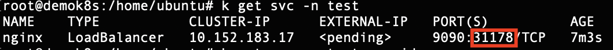
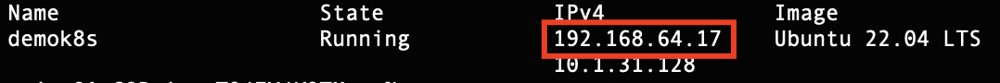
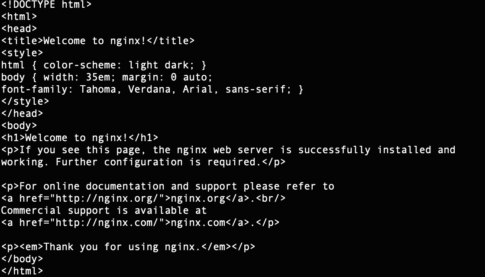
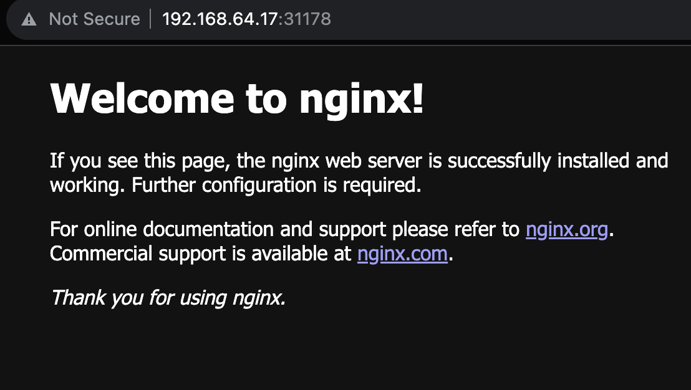
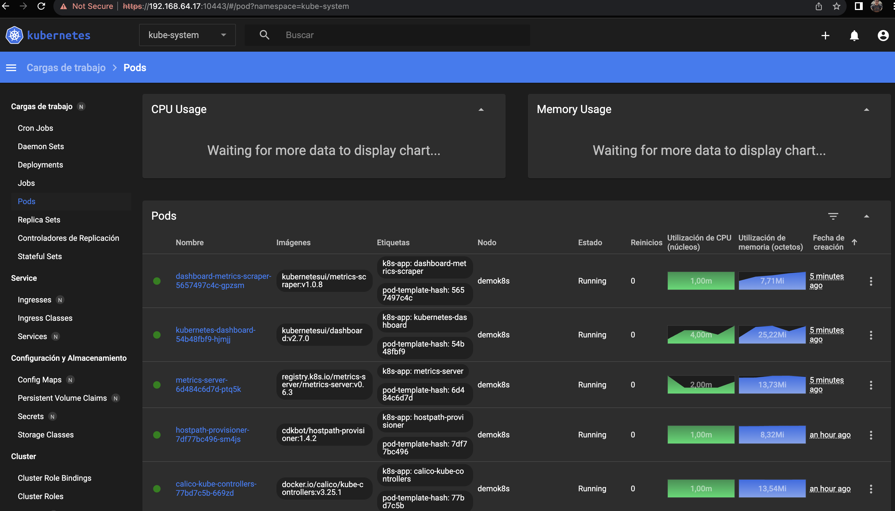

# Kubernetes 101 Workshop

Para la siguiente demo usaremos lo siguiente:

- [Multipass](https://multipass.run/)
- [microk8s](https://microk8s.io/)

### Instalamos Multipass

Podemos instalarlo tanto en Windows, Mac como Linux.

| OS | Referencia |
| ------ | ------ |
| Windows | https://multipass.run/docs/installing-on-windows |
| Mac | https://multipass.run/docs/installing-on-macos |
| Linux | https://multipass.run/docs/installing-on-linux |

Para esta Demo, utilizaremos la instalación en mac utilizando Homebrew

```sh
# Instalamos Multipass con brew cask
$ brew install --cask multipass

# Verificamos que lo tenemos instalado
$ multipass
```

### Creamos nuestro nodo Linux (Ubuntu)

```sh
# Crearemos una instancia Ubuntu pasando como parámetros nombre del nodo, ram y disco que le asignaremos
$ multipass launch --name demok8s --mem 2G --disk 5G

# Ingresaremos dentro de nuestra instancia ya creada
$ multipass shell demok8s

# Verificamos que estamos dentro de la instancia y escalaremos a root
$ sudo su
```

### Instalamos kmicrok8s3s

```sh
# Instalamos microk8s
$ snap install microk8s --classic

# Verificamos la instalacion
$ microk8s status --wait-ready

# Habilitamos algunos componentes de microk8s (Opcional)
$ microk8s enable dashboard
$ microk8s enable dns
$ microk8s enable registry

# Verificamos que tenemos kubernetes instalado
$ microk8s kubectl get all --all-namespaces

# Creamos un alias mas corto para kubectl
$ alias k="microk8s kubectl"
```

### Desplegamos NginX

```sh
# Creamos nuestro manifiesto
$ snap install helm --classic

# Verificamos que tengamos instalado Helm
$ helm
```


### Desplegamos NginX 

```sh
# Creamos nuestro namespace de trabajo
$ k create ns test

# Creamos un pod de nginx
$ k run nginx --image stazdx/nginx -n test

# Verificamos que se haya desplegado nuestro pod
$ k get po -n test

# Vemos logs de nuestro pod creado
$ k logs -f nginx -n test

# Eliminamos nuestro pod creado
$ k delete po nginx -n test

# Vemos nuestro manifiesto a ejecutar con 2 réplicas y el label app=nginx
$ k create deploy nginx --image stazdx/nginx -n test --replicas 2

# Verificamos que se haya desplegado nuestro deployment
$ k get po -n test
$ k get deploy -n test

# Vemos logs centralizados de nuestros pods
$ k logs -f -l app=nginx -n test

# Exponemos un servicio que balancee nuestros 2 pods creados
$ k create service loadbalancer nginx -n test --tcp=9090:80
```

### Verificamos nuestro servicio y obtenemos nuestro puerto
```sh
$ k get svc -n test
```


### Desde otra sesion fuera de la instancia linux verificamos nuestra ip del nodo Linux
```sh
$ multipass ls
```


### Probamos desde nuestra sesion local un curl
```sh
$ curl 192.168.64.17:31178
```



### Desde nuestro navegador



### Extra
```sh
# Ejecuta esto dentro del nodo linux
$ microk8s enable dashboard

# Port-forward del dashboard en tu localhost
$ microk8s dashboard-proxy
```



### Borrar nuestra instancia de Multipass
```sh
# Eliminamos nuestro nodo Linux
$ multipass delete demok8s
$ multipass purge
```

Happy coding :smile: !!